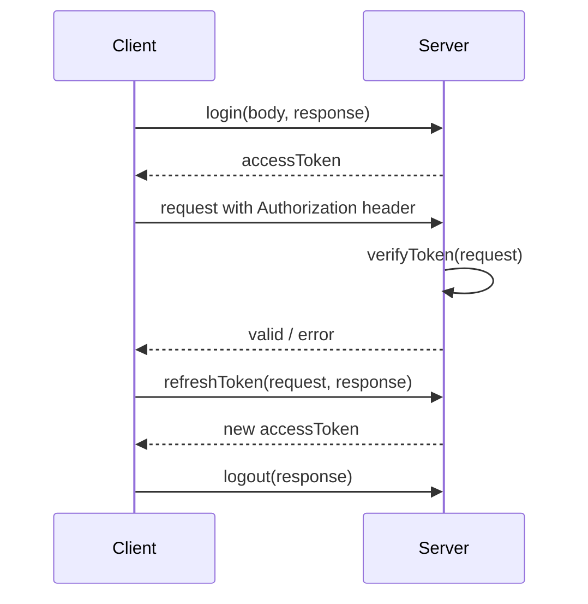
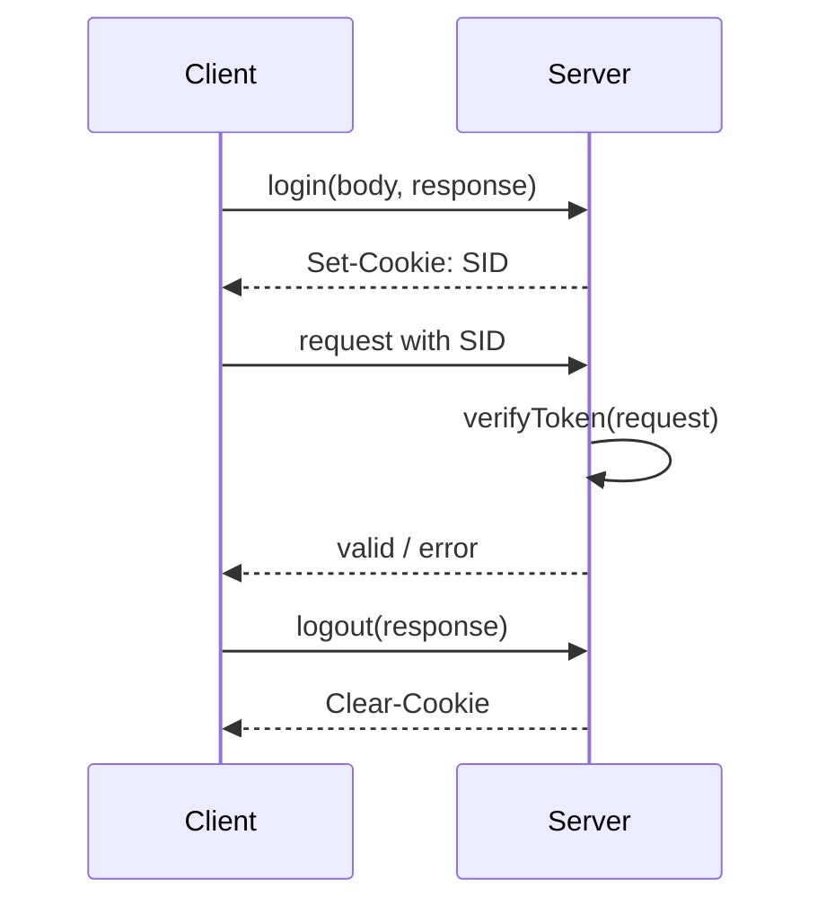
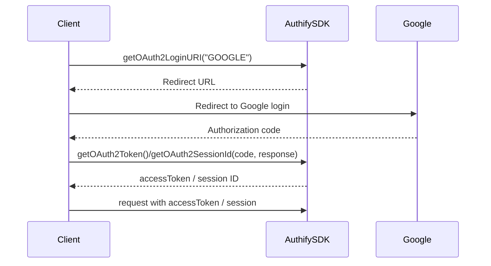

# AuthifySDK Documentations

# I. Introduction
This library provides a unified and flexible authentication integration solution for Java applications. Designed to work seamlessly with most modern Java frameworks—including Spring, Struts 1 & 2, Play Framework, and more—it helps developers quickly implement secure authentication flows with minimal configuration.

The library supports three authentication methods:

-   **JWT-based authentication**
    
-   **Session-based authentication**
    
-   **OAuth2 / OpenID Connect (currently supporting Google as the identity provider)**
    

By combining simple configuration with a dedicated web-based management interface, the library centralizes user authentication data and streamlines the integration process. Whether you're building a new system or enhancing an existing one, this library offers a consistent, extensible, and developer-friendly approach to authentication across Java ecosystems.
# II. Installation
To begin using the library in your Java application, download the latest release from the official distribution site:

**Download:**  
`https://your-domain.com/auth-lib/downloads/auth-lib-latest.jar`

After downloading the JAR file, include it in your project’s classpath or dependency management system. The library is compatible with most Java build tools such as Maven, Gradle, and Ant.

> **Note:** Maven Central / Gradle repository hosting will be provided in future versions.

# III. Configuration

This library provides a flexible configuration system that allows developers to initialize and customize the authentication service according to their application needs. All authentication services are configured through the `AuthifyConfig` class and instantiated via one of the available `AuthifyService` implementations.

## Core Configuration Classes

### **AuthifyConfig**

`AuthifyConfig` is the main configuration container used to initialize any authentication service.  
It includes:

-   **PoolConfig poolConfig** – The user pool configuration (required).
    
-   **List oAuth2Configs** – A list of optional OAuth2/OpenID Connect providers.
    

Configuration objects are created using the built-in builder:

```java
AuthifyConfig.builder()
    .poolConfig(new PoolConfig("your-user-pool-key"))
    .build();

```

### **AuthifyService Implementations**

There are two authentication service implementations:

-   `AuthifyJwtService` – For JWT-based authentication
    
-   `AuthifySessionService` – For session-based authentication
    

Both services receive an `AuthifyConfig` instance via their constructor:

```java
new AuthifyJwtService(AuthifyConfig config);
new AuthifySessionService(AuthifyConfig config);

```

----------

## Configuration in Spring Boot

Below are examples showing how to configure the library inside a Spring Boot application using `@Configuration` and `@Bean`.

### 1. JWT Authentication

```java
@Configuration
public class ApplicationConfig {

    @Bean
    public AuthifyService authifyService() {
        return new AuthifyJwtService(
                AuthifyConfig.builder()
                        .poolConfig(new PoolConfig("your-user-pool-key"))
                        .build()
        );
    }
}

```

### 2. Session-Based Authentication

```java
@Configuration
public class ApplicationConfig {

    @Bean
    public AuthifyService authifyService() {
        return new AuthifySessionService(
                AuthifyConfig.builder()
                        .poolConfig(new PoolConfig("your-user-pool-key"))
                        .build()
        );
    }
}

```

### 3. Adding OAuth2 / OpenID Connect (Google)

OAuth2 can be added to either JWT or Session-based authentication by supplying one or more `OAuth2Config` objects.

#### Example with JWT

```java
@Bean
public AuthifyService authifyService() {
    return new AuthifyJwtService(
            AuthifyConfig.builder()
                    .poolConfig(new PoolConfig("your-user-pool-key"))
                    .addOauth2Config(OAuth2Config.builder()
                            .type(OAuth2Type.GOOGLE)
                            .clientId("client-id")
                            .clientSecret("client-secret")
                            .redirectUri("redirect-uri")
                            .javascriptRedirectUri("front-end-callback-url") // optional
                            .build())
                    .build()
    );
}

```

#### Example with Session-Based Authentication

```java
@Bean
public AuthifyService authifyService() {
    return new AuthifySessionService(
            AuthifyConfig.builder()
                    .poolConfig(new PoolConfig("your-user-pool-key"))
                    .addOauth2Config(OAuth2Config.builder()
                            .type(OAuth2Type.GOOGLE)
                            .clientId("client-id")
                            .clientSecret("client-secret")
                            .redirectUri("redirect-uri")
                            .javascriptRedirectUri("front-end-callback-url") // optional
                            .build())
                    .build()
    );
}
```

----------

## Usage With Other Java Frameworks

For frameworks such as **Struts 1**, **Struts 2**, **Play Framework**, or custom Java applications, the initialization process remains the same:

1.  Build an `AuthifyConfig` object.
    
2.  Instantiate either `AuthifyJwtService` or `AuthifySessionService` using the configuration.
    
3.  Inject or reference the service inside your authentication logic.
    

Example (generic):

```java
AuthifyService service = new AuthifyJwtService(
    AuthifyConfig.builder()
        .poolConfig(new PoolConfig("your-user-pool-key"))
        .build()
);

```
### **Note on Jakarta vs. Javax Servlet Environments**

Some Java frameworks still use the legacy `javax.servlet` package instead of the newer `jakarta.servlet` namespace.  
If your system is using **javax** (e.g., older versions of Spring, Struts, Play, or custom servlet containers), you can switch to the alternative service interface:

>   Use **`authify.sdk.services.javax.AuthifyService`**  
    instead of  **`authify.sdk.services.jakarta.AuthifyService`**
    
Both variants provide identical functionality; the only difference is the underlying servlet API they support.

# IV. Methods

The `AuthifyService` interface defines all authentication-related operations available in the Authify SDK. Depending on whether your application uses **JWT** or **Session-Based** authentication, the underlying behavior may differ, but the method signatures and usage remain identical.

Every method may throw `AuthifyResponseException` when the server returns a non-200 status or when validation fails.

Below is the complete list of supported operations.

----------

## 1. `verifyToken(HttpServletRequest request)`

Verifies the access token extracted from the incoming HTTP request.  
For JWT mode, the token is parsed and validated.  
For Session mode, the session ID is checked.

### **Parameters**

-   `request` — HTTP request containing token/session ID in headers or cookies.
    

### **Returns**

-   `AuthifyResponse` — status 200 if valid, otherwise error.
    

### **Throws**

-   `AuthifyResponseException` when token/session is invalid or expired.
    

----------

## 2. `resendActiveAccountCode(HttpServletRequest request, HttpServletResponse response)`

Resends a new account activation code to the registered email.  
A new `NEED_ACTIVE_ID` cookie will be added to the response.

### **Parameters**

-   `request` — contains `NEED_ACTIVE_ID`.
    
-   `response` — used to set a new `NEED_ACTIVE_ID` cookie.
    

### **Returns**

-   `AuthifyResponse`
    

### **Throws**

-   `AuthifyResponseException` when request is invalid or resend fails.
    

----------

## 3. `resendResetCode(HttpServletRequest request, HttpServletResponse response)`

Resends the password-reset OTP code.  
A new `NEED_RESET_ID` cookie will be added to the response.

### **Parameters**

-   `request` — contains `NEED_RESET_ID`.
    
-   `response` — used to set new cookie.
    

### **Returns**

-   `AuthifyResponse`
    

### **Throws**

-   `AuthifyResponseException` on failure.
    

----------

## 4. `refreshToken(HttpServletRequest request, HttpServletResponse response)`

Issues a new **access token** using the refresh token.

### **Parameters**

-   `request` — contains the refresh token (header/cookie).
    
-   `response` — may be used to update token headers/cookies.
    

### **Returns**

-   `String` — new access token.
    

### **Throws**

-   `AuthifyResponseException` when refresh token is missing, expired or invalid.
    

----------

## 5. `signUp(ATFNMAuthReqBody body, HttpServletResponse response)`

Creates a new user account.  
You do **not** need to fill all fields of `ATFNMAuthReqBody`; only authorization-related fields are required.

### **Parameters**

-   `body` — user registration info (username, email, password, phone, etc.)
    
-   `response` — used to set cookies related to activation flow.
    

### **Returns**

-   `AuthifyResponse`
    

### **Throws**

-   `AuthifyResponseException` when signup fails.
    

----------

## 6. `login(ATFNMAuthReqBody body, HttpServletResponse response)`

Authenticates a user using the provided credentials.

### **Parameters**

-   `body` — must contain username + password.
    
-   `response` — used to set authentication cookies for session-based mode.
    

### **Returns**

-   `String` — access token (JWT) or session ID (session mode).
    

### **Throws**

-   `AuthifyResponseException` on incorrect credentials or login failure.
    

----------

## 7. `changePassword(String oldPassword, String newPassword, HttpServletRequest request)`

Changes the user's password.

### **Parameters**

-   `oldPassword`
    
-   `newPassword`
    
-   `request` — used to extract current access token.
    

### **Returns**

-   `AuthifyResponse`
    

### **Throws**

-   `AuthifyResponseException` when authentication fails or password is incorrect.
    

----------

## 8. `activeSignUpUser(String activeCode, HttpServletRequest request, HttpServletResponse response)`

Confirms a new user’s account using the activation code sent by email.

### **Parameters**

-   `activeCode` — activation OTP.
    
-   `request` — contains activation session/cookie.
    
-   `response` — sets updated cookie if needed.
    

### **Returns**

-   `AuthifyResponse`
    

### **Throws**

-   `AuthifyResponseException` when code is invalid or expired.
    

----------

## 9. `getUserInfo(HttpServletRequest request)`

Retrieves user information using the access token provided in the request.

### **Parameters**

-   `request` — contains access token/session ID.
    

### **Returns**

-   `AuthifyUserEntity` — user profile.
    

### **Throws**

-   `AuthifyResponseException` if the token is invalid or the user cannot be found.
    

----------

## 10. `updateUser(AuthifyUserEntity userData, HttpServletRequest request)`

Updates the user’s profile.  
Only **non-null** fields are updated.  
Username and password **cannot** be updated with this method.

### **Parameters**

-   `userData` — profile data to update.
    
-   `request` — used to extract authentication token.
    

### **Returns**

-   `AuthifyUserEntity` — updated user profile.
    

### **Throws**

-   `AuthifyResponseException` (e.g., email already exists).
    

----------

## 11. `resetPasswordStep1(String username, HttpServletResponse response)`

Initiates the password reset process.

### **Parameters**

-   `username`
    
-   `response` — used to set `NEED_RESET_ID` cookie.
    

### **Returns**

-   `AuthifyResponse`
    

### **Throws**

-   `AuthifyResponseException`
    

----------

## 12. `resetPasswordStep2(String code, HttpServletRequest request, HttpServletResponse response)`

Validates the OTP code for password reset.

### **Parameters**

-   `code` — OTP
    
-   `request` — contains reset ID
    
-   `response` — sets a new cookie for step 3
    

### **Returns**

-   `AuthifyResponse`
    

### **Throws**

-   `AuthifyResponseException`
    

----------

## 13. `resetPasswordStep3(String newPassword, HttpServletRequest request, HttpServletResponse response)`

Completes password reset by setting the new password.

### **Parameters**

-   `newPassword`
    
-   `request` — contains reset ID
    
-   `response` — updates cookie/metadata
    

### **Returns**

-   `AuthifyResponse`
    

### **Throws**

-   `AuthifyResponseException`
    

----------

## 14. `logout(HttpServletResponse response)`

Invalidates the current access token or session.  
The server will set an expired/null token in the response.

### **Parameters**

-   `response`
    

### **Returns**

-   `String` — status message.
    

----------

# V. OAuth2 Methods

These methods are available when OAuth2/OpenID Connect is configured (e.g., Google).

----------

## 15. `getOAuth2LoginURI(String oAuthType)`

Generates the login URL for the OAuth2 provider.

### **Parameters**

-   `oAuthType` — provider name (e.g., `"GOOGLE"`)
    

### **Returns**

-   `String` — redirect URI for frontend.
    

----------

## 16. `getOAuth2Token(String oAuthType, String code, HttpServletResponse response)`

Exchanges the OAuth2 authorization code for an **access token**.

### **Parameters**

-   `oAuthType`
    
-   `code` — authorization code returned by provider
    
-   `response` — used to set cookies
    

### **Returns**

-   `String` — access token
    

### **Throws**

-   `AuthifyResponseException`.
    

----------

## 17. `getOAuth2SessionId(String oAuthType, String code, HttpServletResponse response)`

Same as `getOAuth2Token`, but returns a **session ID** instead of a JWT (for session-based implementations).

### **Parameters**

-   `oAuthType`
    
-   `code` — authorization code returned by provider
    
-   `response` — used to set cookies
    

### **Returns**

-   `String` — session ID
    

### **Throws**

-   `AuthifyResponseException`.
    
Tuyệt vời. Dựa trên thông tin này, tôi có thể viết phần **Error Handling** cho tài liệu docs của bạn như sau, chuẩn technical documentation, rõ ràng và dễ hiểu cho developer:

----------

# VI. Error Handling

The Authify SDK uses a unified exception mechanism to handle errors returned by the authentication server.  
All methods in `AuthifyService` that can fail throw **`AuthifyResponseException`** whenever the server response status code is **not 200**.

----------

## `AuthifyResponseException`

`AuthifyResponseException` extends `java.lang.Exception` and contains additional information about the failure.

### **Fields**

| Field        | Type      | Description                                                                     |
| ------------ | --------- | ------------------------------------------------------------------------------- |
| `statusCode` | `Integer` | HTTP-like status code returned by the server (e.g., 400, 401, 403, 500).        |
| `code`       | `Integer` | Internal SDK or server error code.                                              |
| `message`    | `String`  | Error message describing the cause of the failure. (Inherited from `Exception`) |


### **Constructor**

```java
public AuthifyResponseException(AuthifyResponse result)

```

-   Initializes the exception using an `AuthifyResponse` object.
    
-   Automatically sets `statusCode` and `code` fields from the response.
    

### **Getters**

```java
Integer getStatusCode()
Integer getCode()

```
## Handle Exceptions

When calling any `AuthifyService` method that interacts with the server, you should catch `AuthifyResponseException` to handle errors gracefully.

### Example: Login

```java
try {
    String accessToken = authifyService.login(body, response);
    // login successful
} catch (AuthifyResponseException ex) {
    System.out.println("Login failed!");
    System.out.println("Status Code: " + ex.getStatusCode());
    System.out.println("Error Code: " + ex.getCode());
    System.out.println("Message: " + ex.getMessage());
}

```
| Code | Message                       | Status Code | Description                                        |
| ---- | ----------------------------- | ----------- | -------------------------------------------------- |
| 4000 | Pool key is missing           | 400         | Configuration missing required pool key.           |
| 4001 | Pool key is invalid           | 400         | Provided pool key is invalid.                      |
| 4002 | Username existed in pool      | 400         | Username already exists in the user pool.          |
| 4003 | Email existed in pool         | 400         | Email already exists in the user pool.             |
| 4004 | Security. Wrong username      | 400         | Security check failed: wrong username.             |
| 4005 | Security. Wrong password      | 400         | Security check failed: wrong password.             |
| 4006 | Security. Wrong optional      | 400         | Security check failed: wrong optional parameter.   |
| 4007 | Missing username              | 400         | Required username field is missing.                |
| 4008 | Missing password              | 400         | Required password field is missing.                |
| 4009 | Missing optional              | 400         | Required optional field is missing.                |
| 4010 | No Authorization header       | 401         | Missing Authorization header in request.           |
| 4010 | Invalid Authorization header  | 401         | Authorization header is invalid.                   |
| 4011 | No refresh token              | 401         | Refresh token is missing in request.               |
| 4012 | Invalid refresh token         | 401         | Refresh token is invalid or expired.               |
| 4013 | Access token expired          | 401         | Access token has expired.                          |
| 4014 | Refresh token expired         | 401         | Refresh token has expired.                         |
| 4015 | Missing key                   | 400         | Required key parameter is missing.                 |
| 4016 | Code no match                 | 400         | OTP or validation code does not match.             |
| 4017 | Missing email                 | 400         | Required email field is missing.                   |
| 4018 | Expired code                  | 400         | OTP or validation code has expired.                |
| 4019 | Expired code                  | 401         | Session ID is invalid or expired.                  |


> **Note:** Always catch `AuthifyResponseException` to prevent unhandled exceptions and to provide meaningful feedback to users.

Dưới đây là phần **Authentication Flows** cho tài liệu của bạn, được viết chi tiết với **step-by-step** và giải thích rõ ràng từng luồng cho **JWT, Session-Based, OAuth2 (Google)**. Phần này giúp developer dễ hình dung cách SDK hoạt động trong thực tế.

---
Hoàn toàn được! Dưới đây là phiên bản **Authentication Flows** với **Mermaid diagrams**, phù hợp để chèn trực tiếp vào docs markdown hoặc tài liệu hỗ trợ Mermaid. Tôi đã chuyển các sequence diagram ASCII cũ sang Mermaid sequence diagram:

----------

# VII. Authentication Flows

The Authify SDK supports three authentication methods:

1.  **JWT Authentication**
    
2.  **Session-Based Authentication**
    
3.  **OAuth2 / OpenID Connect (currently Google)**
    

----------

## 1. JWT Authentication Flow

JWT (JSON Web Token) authentication is stateless and commonly used for REST APIs.

### **Flow Steps**

1.  **Login**
    
    -   `authifyService.login(body, response)` with username/password.
        
    -   Returns a JWT access token (and optionally a refresh token).
        
2.  **Access Protected Resources**
    
    -   Include the access token in HTTP headers:
        
        ```http
        Authorization: Bearer <access-token>
        
        ```
        
    -   Verify the token with `authifyService.verifyToken(request)`.
        
3.  **Refresh Token**
    
    -   Call `authifyService.refreshToken(request, response)` when the token expires.
        
4.  **Logout**
    
    -   Call `authifyService.logout(response)` to invalidate the token.
        

### **Diagram**



----------

## 2. Session-Based Authentication Flow

Session-based authentication relies on server-side session storage and cookies.

### **Flow Steps**

1.  **Login**
    
    -   Call `authifyService.login(body, response)`.
        
    -   Server generates a **session ID** and sets it in a cookie.
        
2.  **Access Protected Resources**
    
    -   Session ID sent automatically via cookies.
        
    -   Server validates session using `authifyService.verifyToken(request)`.
        
3.  **Logout**
    
    -   Call `authifyService.logout(response)` to clear the session cookie.
        

### **Diagram**



----------

## 3. OAuth2 / OpenID Connect (Google) Flow

OAuth2 allows login via third-party identity providers.

### **Flow Steps**

1.  **Redirect to OAuth2 Provider**
    
    -   Generate login URL: `authifyService.getOAuth2LoginURI("GOOGLE")`
        
    -   Redirect user to Google login page.
        
2.  **Authorization Code**
    
    -   User logs in on Google.
        
    -   Google redirects back with an **authorization code**.
        
3.  **Exchange Code**
    
    -   Call:
        
        ```java
        authifyService.getOAuth2Token("GOOGLE", code, response); // JWT
        
        ```
        
        or
        
        ```java
        authifyService.getOAuth2SessionId("GOOGLE", code, response); // Session
        
        ```
        
4.  **Access Protected Resources**
    
    -   Use JWT in headers or session cookie.
        
5.  **Logout**
    
    -   Call `authifyService.logout(response)`.
        

### **Mermaid Diagram**



----------

### **Best Practices for Authentication Flows**

-   Always verify tokens or session IDs before granting access.
    
-   Store JWTs securely in HttpOnly cookies or secure client storage.
    
-   Use HTTPS to protect tokens and cookies.
    
-   Handle token expiration gracefully using refresh tokens or re-login flows.
    
-   OAuth2 redirect URIs must be secure to prevent token leaks.
    
    Hiểu rồi! Nếu bạn muốn kết thúc phần docs, phần **Conclusion / Final Notes** nên tóm gọn lại các thông tin quan trọng, nhắc developer về các lưu ý, và cung cấp link tham khảo hoặc thông tin hỗ trợ. Dưới đây là một phiên bản phù hợp cho tài liệu SDK của bạn:

----------

# VIII. Conclusion

The Authify SDK provides a flexible and easy-to-integrate authentication solution for Java-based applications. It supports **JWT**, **Session-Based**, and **OAuth2 / OpenID Connect (Google)** authentication methods, allowing developers to secure their web applications efficiently.

### Key Takeaways

-   **Easy Configuration:** Simple `AuthifyConfig` setup with support for user pools and OAuth2 providers.
    
-   **Unified Error Handling:** All server response errors are thrown as `AuthifyResponseException`, with detailed `statusCode` and `code` for precise handling.
    
-   **Flexible Integration:** Works with most Java frameworks including Spring, Struts 1-2, and Play.
    
-   **Secure Token Management:** Supports access tokens, refresh tokens, and session IDs with proper cookie handling.
    
-   **Extensible:** Future OAuth2 providers can be added easily via `OAuth2Config`.
    

### Recommended Practices

-   Always verify tokens or session IDs before granting access.
    
-   Handle `AuthifyResponseException` properly to give meaningful feedback.
    
-   Use HTTPS and secure cookie flags to protect sensitive information.
    
-   Keep user data up-to-date using `updateUser` while respecting immutable fields like username and password.
    

For more details, examples, and advanced configuration, refer to the sections above.

> Thank you for choosing Authify SDK – secure your Java application with confidence!
